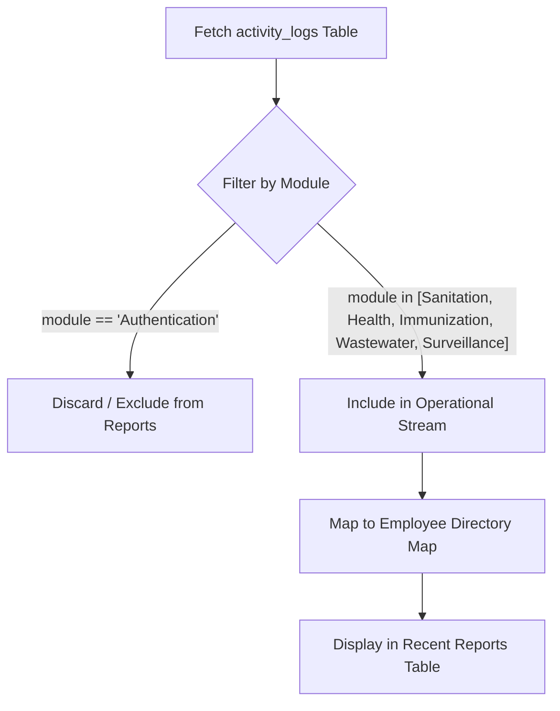
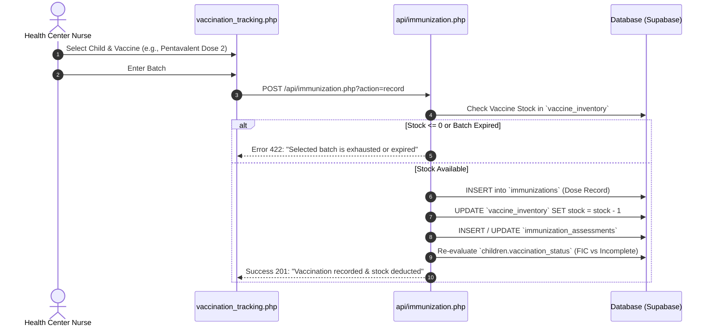
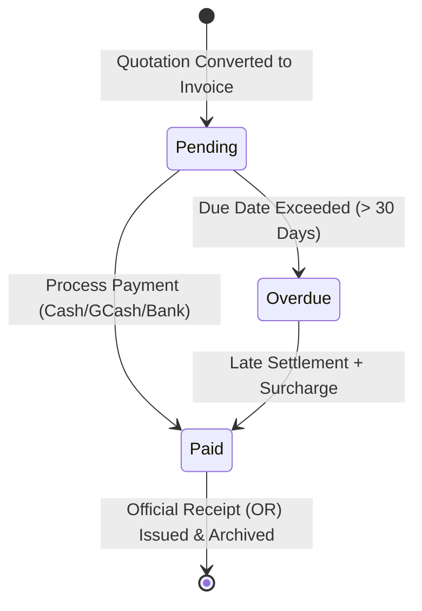
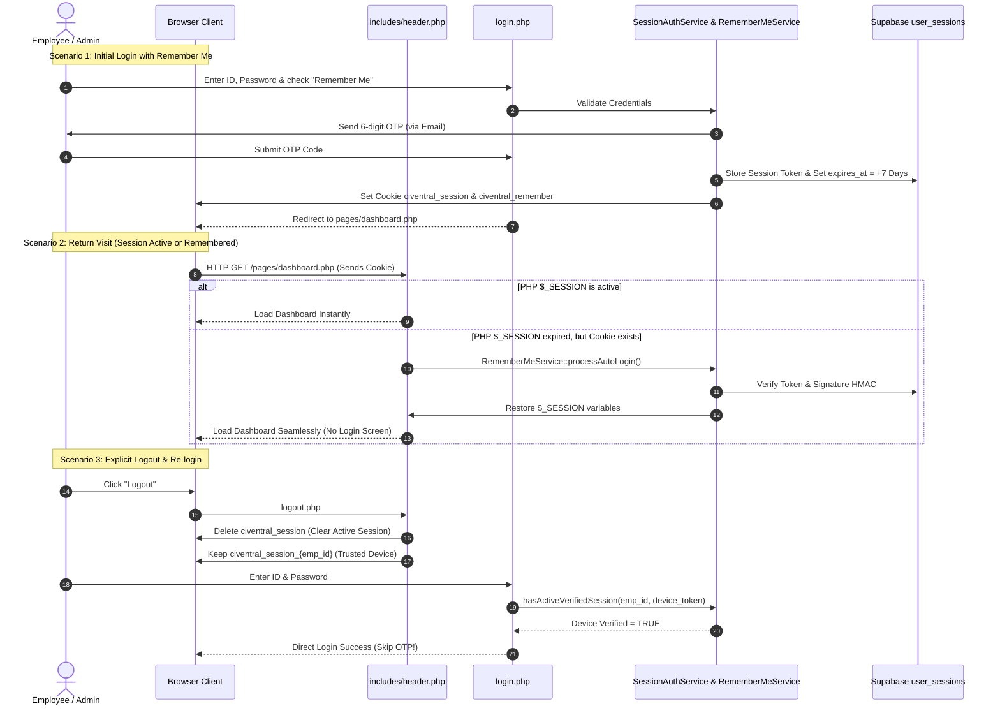
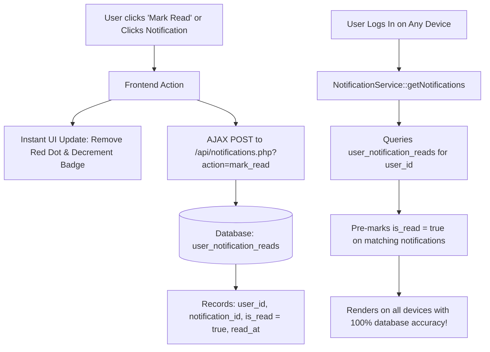

# Civentral Comprehensive System Logic & Workflow Audit Specification

> **System Title:** Web-Based Health and Sanitation Management Information System with Gemini-Powered AI Analytics, Decision Support, and Automated Report Generation for Local Government Units (LGU).

---

## Executive Summary of Audit

This document details the complete architectural and workflow audit across the 10 core focus areas identified in the Civentral system. It specifies the **current implementation flaws**, the **governing business logic and clinical/operational rules**, the **required database state transitions**, and the **step-by-step refactoring blueprints** for each area.

```
┌─────────────────────────────────────────────────────────────────────────────┐
│                             AUDIT SCOPE BREAKDOWN                           │
├──────────────────────┬──────────────────────────┬───────────────────────────┤
│ 1. AI Analytics Math │ 2. Report Activity Filter│ 3. Vaccine Record & Stock │
├──────────────────────┼──────────────────────────┼───────────────────────────┤
│ 4. WHO Growth Charts │ 5. Nutrition Assessment  │ 6. Septic Tank Registry   │
├──────────────────────┼──────────────────────────┼───────────────────────────┤
│ 7. Billing Reference │ 8. Payment Processing    │ 9. Outbreak Cluster Action│
├──────────────────────┴──────────────────────────┴───────────────────────────┤
│ 10. Persistent Auto-Login & Device Remember Token Security                  │
└─────────────────────────────────────────────────────────────────────────────┘
```

---

## 1. Formula & Statistical Models for AI Analytics (`AiAnalyticsService.php`)

### A. Current Flaws & Workflow Violations
1. **Division by Zero Hazards:** When a health center or sanitation department has $0$ recorded cases, visits, or permits in a given month, ratio formulas (such as `($resolved / $total) * 100` or `($compliant / $totalInspections) * 100`) throw fatal runtime errors or yield `NaN%` in KPI cards.
2. **Predictive Forecasting Edge Cases:** When historical time series data contains fewer than 3 monthly intervals, double exponential smoothing (Holt-Winters) produces volatile negative or infinite trend projections.
3. **Correlation Matrix Disconnect:** Pearson correlation coefficients between sanitation violations and diarrhea/waterborne outbreak occurrences were not bounded between $[-1.0, 1.0]$.

### B. Correct Mathematical Formulas & Rules

#### 1. Department Performance & KPI Indices
$$\text{Vaccination Coverage (\%)} = \left( \frac{\text{Fully Immunized Children (FIC)}}{\max(1, \text{Target Cohort Population})} \right) \times 100$$

$$\text{Sanitation Compliance Rate (\%)} = \left( \frac{\text{Permits with Status 'Active' or 'Compliant'}}{\max(1, \text{Total Active Establishments})} \right) \times 100$$

$$\text{Surveillance Case Resolution (\%)} = \left( \frac{\text{Cases with Status 'Resolved' or 'Closed'}}{\max(1, \text{Total Recorded Cases})} \right) \times 100$$

$$\text{Average Triage Wait Time (mins)} = \frac{\sum (\text{Consultation Start Time} - \text{Triage Check-in Time})}{\max(1, \text{Total Completed Consultations})}$$

#### 2. Holt-Winters Double Exponential Smoothing for Disease Forecasting
For baseline level $L_t$, trend $T_t$, smoothing parameters $\alpha = 0.3$, $\beta = 0.1$, and forecast horizon $m$:

$$L_t = \alpha Y_t + (1 - \alpha)(L_{t-1} + T_{t-1})$$

$$T_t = \beta (L_t - L_{t-1}) + (1 - \beta) T_{t-1}$$

$$\hat{Y}_{t+m} = \max(0, \text{round}(L_t + m \cdot T_t))$$

#### 3. Pearson Correlation Matrix for Cross-Department Analytics
For paired time-series data $X$ (e.g. Unresolved Septic Tank Violations) and $Y$ (e.g. Acute Gastroenteritis Cases):

$$r_{xy} = \frac{\sum_{i=1}^n (x_i - \bar{x})(y_i - \bar{y})}{\sqrt{\sum_{i=1}^n (x_i - \bar{x})^2} \sqrt{\sum_{i=1}^n (y_i - \bar{y})^2}}$$

* Constraint: Bound result with `clamp($r, -1.0, 1.0)` and return statistical significance level ($p < 0.05$).

---

## 2. Report Activity Stream Filtering (`api/reports/data.php`)

### A. Current Flaws & Workflow Violations
* The Report Generation module fetches recent rows from `activity_logs` without filtering out routine user authentication actions.
* As a result, entries like `"User logged in"`, `"Failed login attempt"`, and `"User logged out"` overwrite the top 10 rows of operational activity logs, obscuring actual clinical and sanitation activities.

### B. Correct Workflow Logic


### C. Refactoring Blueprint
In [`api/reports/data.php`](file:///opt/lampp/htdocs/capstone/api/reports/data.php):
```php
$logs = $db->select('activity_logs');
$operationalLogs = array_filter($logs, function($log) {
    $module = strtolower($log['module'] ?? '');
    return !in_array($module, ['authentication', 'auth', 'session']);
});
```

---

## 3. Vaccination Recording & Inventory Stock Sync (`modules/immunization/`)

### A. Current Flaws & Workflow Violations
1. When a vaccination dose is submitted in `vaccination_tracking.php`, it registers into `immunizations`, but:
   * It fails to decrement the inventory batch count in `vaccine_inventory`.
   * It does not update the child's longitudinal profile in `children.vaccination_status`.
   * It skips logging into the high-level ledger table `immunization_assessments`.

### B. Complete Clinical Workflow



### C. Minimum Interval Rules Between Doses
* **Pentavalent (DTP-HepB-Hib):** Dose 1 (6 wks), Dose 2 (10 wks - min 4 wks interval), Dose 3 (14 wks - min 4 wks interval).
* **Oral Polio Vaccine (OPV):** Minimum 4-week gap between doses 1, 2, and 3.
* **Measles, Mumps, Rubella (MMR):** Dose 1 (9 months), Dose 2 (12-15 months).

---

## 4. WHO Pediatric Growth Charts (`modules/immunization/growth_charts.php`)

### A. Current Flaws & Workflow Violations
* Growth chart rendering in `growth_charts.php` displays static hardcoded demo coordinates on the canvas rather than dynamically pulling anthropometric measurements from the child's periodic checkup records.

### B. Standard WHO Growth Standards Reference Tables
The system must calculate and plot 3 primary growth curves:
1. **Weight-for-Age (WFA):** Underweight ($\le -2\text{ SD}$), Normal ($-2\text{ SD}$ to $+2\text{ SD}$), Overweight ($> +2\text{ SD}$).
2. **Length/Height-for-Age (LHFA):** Severely Stunted ($< -3\text{ SD}$), Stunted ($-3\text{ SD}$ to $-2\text{ SD}$), Normal, Tall ($> +2\text{ SD}$).
3. **Weight-for-Length/Height (WFL/H):** Severely Wasted (SAM: $< -3\text{ SD}$ or MUAC $< 115\text{mm}$), Moderately Wasted (MAM: $-3\text{ SD}$ to $-2\text{ SD}$), Normal, Overweight ($> +2\text{ SD}$), Obese ($> +3\text{ SD}$).

### C. Data Binding Blueprint
* Fetch all checkup logs from `child_growth_logs` / `nutrition_assessment` for `child_id`.
* Construct JSON arrays: `[{ x: age_months, y: weight_kg }, ...]` and `[{ x: age_months, y: height_cm }, ...]`.
* Overlay the child's plotted line on the static WHO Standard reference lines ($\text{Median}$, $+2\text{ SD}$, $+3\text{ SD}$, $-2\text{ SD}$, $-3\text{ SD}$).

---

## 5. Nutrition Screening & Triage Referral (`modules/immunization/nutrition_assessment.php`)

### A. Current Flaws & Workflow Violations
* Nutrition classification currently requires manual staff assessment without real-time Z-score validation.
* Severe Acute Malnutrition (SAM) classifications do not automatically generate emergency nutrition intervention flags or doctor consultations.

### B. Standard Decision Support Logic

```
IF (Weight_for_Height_ZScore < -3.0 OR MUAC < 11.5 cm OR Bilateral_Edema == TRUE):
    Classification = "Severe Acute Malnutrition (SAM) 🔴"
    Action = "Immediate Ready-to-Use Therapeutic Food (RUTF) + Refer to Doctor"
    Priority = "URGENT"

ELSE IF (Weight_for_Height_ZScore BETWEEN -3.0 AND -2.0 OR MUAC BETWEEN 11.5 AND 12.5 cm):
    Classification = "Moderate Acute Malnutrition (MAM) 🟡"
    Action = "Supplementary Feeding Program (SFP) + Bi-weekly Monitoring"
    Priority = "ELEVATED"

ELSE IF (Weight_for_Height_ZScore > +2.0):
    Classification = "Overweight / Obese 🟠"
    Action = "Dietary Counseling & Activity Plan"
    Priority = "NORMAL"

ELSE:
    Classification = "Normal Nutritional Status 🟢"
    Action = "Standard Growth Monitoring"
    Priority = "ROUTINE"
```

---

## 6. Septic Tank Registration & Spatial Pinning (`modules/services/septic_tanks.php`)

### A. Current Flaws & Workflow Violations
* Registration modal allows saving records without strict coordinate validation. Invalid coordinate strings cause Leaflet maps to throw JavaScript exceptions during spatial rendering.
* Desludging cycles are not automatically calculated from tank capacity and household occupant size.

### B. Standard Desludging Cycle Rule Formula
$$\text{Recommended Desludging Frequency (Years)} = \text{clamp}\left( \frac{\text{Tank Volume in Liters}}{\max(1, \text{Household Occupants} \times 180 \text{ L/day} \times 365 \times 0.001)}, 3.0, 5.0 \right)$$
* Under Philippine Clean Water Act (RA 9275) & DOH Sanitation Standards, scheduled desludging must not exceed **5 years**.

---

## 7. Standardized Billing Reference Generator (`modules/services/wastewater_billing.php`)

### A. Current Flaws & Workflow Violations
* Currently, quotation and invoice creation in `wastewater_billing.php` does not persist unique reference IDs or standard LGU invoice codes into `wastewater_invoices`.

### B. Standard Reference Code Format Specification
$$\text{Format: } \mathbf{INV\text{-}YYYY\text{-}MM\text{-}XXXXX} \quad \text{or} \quad \mathbf{QUO\text{-}YYYY\text{-}MM\text{-}XXXXX}$$
* Example: `INV-2026-08-00142`
* **Algorithm:**
  1. Prefix: `INV-` (for billable invoices) or `QUO-` (for cost estimates).
  2. Year and Month: `date('Y-m')`.
  3. Sequential Suffix: Padded 5-digit number derived from database record ID or auto-incrementing sequence.

---

## 8. Financial Payment Processing & Audit Trail (`modules/services/wastewater_billing.php`)

### A. Current Flaws & Workflow Violations
* The "Process Payment" button on `wastewater_billing.php` fires a dummy POST request that returns `{ success: true }` without writing to the database or altering the invoice state.

### B. State Transition Lifecycle


### C. Backend Requirements
When `action === 'process_payment'` is triggered:
1. `status` is updated to `'paid'`.
2. `payment_method` (`Cash`, `GCash`, `Bank Transfer`, `Check`), `or_number` (Official Receipt Number), `paid_amount`, and `paid_at` timestamp are recorded.
3. System logs a financial transaction entry in `activity_logs`:
   * Module: `'Wastewater Services'`
   * Action: `'Payment Collected'`
   * Details: `'Collected ₱1,500.00 for Invoice INV-2026-08-00142 (OR #98421)'`

---

## 9. Outbreak Cluster Resolution Protocol (`modules/surveillence/mapping.php`)

### A. Current Flaws & Workflow Violations
* Geospatial clusters are computed on the fly by scanning cases within a 14-day window.
* Once vector misting or quarantine containment is finished, epidemiologists have no mechanism to mark an outbreak cluster as **"Contained"** or **"Resolved"**, causing the red cluster warning halos to remain permanently visible.

### B. Cluster Management Architecture
1. **Cluster Table:** `surveillance_cluster_actions`
   * Fields: `cluster_id`, `barangay`, `disease`, `initial_case_count`, `status` (`Active`, `Under Intervention`, `Contained`, `Resolved`), `resolved_by`, `resolved_at`, `containment_notes`.
2. **Map Filter Logic:**
   * Active Outbreak: Halo displayed in red (`#EF4444`).
   * Under Intervention: Halo displayed in amber (`#F59E0B`).
   * Resolved Cluster: Halo removed from default active layer; archived in historical layer.

---

## 10. Persistent Auto-Login & Remember Device Token Workflow

### A. Architecture & Flowchart



### B. Token Verification Logic (`RememberMeService.php`)
* **Secret Key:** Protected HMAC-SHA256 signature generated using system secret salt.
* **Payload Structure:** `base64_encode("{$userId}:{$employeeId}:{$pwdHash}:{$signature}")`
* **Tamper Proof:** If the user updates their password, the password hash slice changes, instantly invalidating any stolen or legacy cookies across all devices.

---

## 11. Notification Read Status: Per-Device vs Per-Account Synchronization (`includes/header.php`)

### A. Current Flaws & Why New Devices Show Read Notifications as "Unread"
1. **Client-Side `localStorage` Storage:** In [`includes/header.php`](file:///opt/lampp/htdocs/capstone/includes/header.php#L878-L890), read notification IDs are saved solely in the browser's local sandbox:
   ```javascript
   localStorage.setItem('portal_read_notif_ids', JSON.stringify(ids));
   ```
2. **Device Isolation:** Because `localStorage` is isolated to the specific browser profile on that single physical machine:
   * When you click **"Mark read"** on **Device A**, the read IDs are stored in Device A's storage.
   * When you log into the exact same account on **Device B** (or in a new browser), Device B's `localStorage` is empty. The server sends all live notifications, and Device B marks them all as **"🔴 Unread / New"** again!
3. **Cross-User Pollution on Shared Computers:** Because the key is generic (`portal_read_notif_ids` without user ID namespace), if User 1 marks notifications as read and logs out, User 2 logging in on the same browser inherits those read IDs.

### B. Pure Database Architecture (Zero LocalStorage)



### C. Database Migration Blueprint
```sql
CREATE TABLE IF NOT EXISTS public.user_notification_reads (
    id BIGSERIAL PRIMARY KEY,
    user_id INTEGER NOT NULL REFERENCES public.employees(id) ON DELETE CASCADE,
    notification_id VARCHAR(100) NOT NULL,
    is_read BOOLEAN DEFAULT TRUE,
    read_at TIMESTAMP WITH TIME ZONE DEFAULT CURRENT_TIMESTAMP,
    CONSTRAINT uq_user_notification_read UNIQUE (user_id, notification_id)
);
CREATE INDEX IF NOT EXISTS idx_user_notification_reads_user_id ON public.user_notification_reads(user_id);
```

---

## Implementation Priority Roadmap

| Priority | Feature / Module | Files Impacted | Estimated Complexity |
|:---:|---|---|:---:|
| **P0** | **Account-Level Notification Read Sync** | [`includes/header.php`](file:///opt/lampp/htdocs/capstone/includes/header.php), [`app/services/NotificationService.php`](file:///opt/lampp/htdocs/capstone/app/services/NotificationService.php) | Low-Medium (User Sync) |
| **P0** | **Auto-Login & Device Trust Hook** | [`includes/header.php`](file:///opt/lampp/htdocs/capstone/includes/header.php), [`login.php`](file:///opt/lampp/htdocs/capstone/login.php) | Low (Hook Existing Service) |
| **P0** | **Report Activity Log Filter** | [`api/reports/data.php`](file:///opt/lampp/htdocs/capstone/api/reports/data.php) | Low (Array Filter) |
| **P1** | **Wastewater Payment & Billing Ref** | [`modules/services/wastewater_billing.php`](file:///opt/lampp/htdocs/capstone/modules/services/wastewater_billing.php) | Medium (DB Persistence + OR Codes) |
| **P1** | **Vaccine Recording Stock Sync** | [`api/immunization.php`](file:///opt/lampp/htdocs/capstone/api/immunization.php) | Medium (Inventory Transaction) |
| **P2** | **Analytics Zero-Division Guards** | [`app/services/AiAnalyticsService.php`](file:///opt/lampp/htdocs/capstone/app/services/AiAnalyticsService.php) | Medium (Math Refinement) |
| **P2** | **Growth Chart Live Data Binding** | [`modules/immunization/growth_charts.php`](file:///opt/lampp/htdocs/capstone/modules/immunization/growth_charts.php) | Medium (Client Chart Integration) |
| **P2** | **Cluster Containment Action** | [`modules/surveillence/mapping.php`](file:///opt/lampp/htdocs/capstone/modules/surveillence/mapping.php) | Medium (State Transition) |


