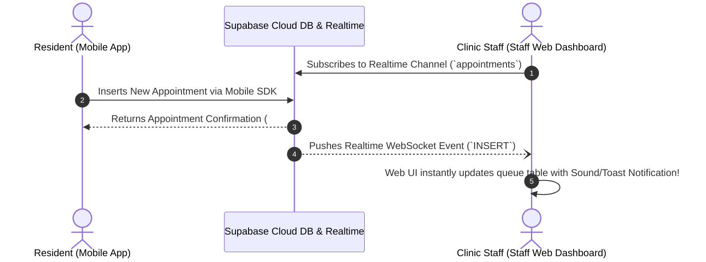

# Government Service Management System (GSMS)
## Citizen Mobile App Integration Plan & Supabase Architecture Specification

**Lead Module:** Health & Sanitation Management (HSM)  
**Database & Realtime Engine:** Supabase (PostgreSQL + Realtime WebSockets + Supabase Auth)  
**Target Audience:** GSMS Project Lead, Citizen Mobile App Team, and Capstone Panel  
**Date:** August 28, 2026  
**Document Version:** 2.0.0 (Supabase-Powered Edition)

---

## 1. Executive Summary & Why Supabase is a Game Changer

Because our system uses **Supabase**, connecting the **Citizen Mobile App** and the **Staff Web Portal** is dramatically faster and easier than traditional custom REST APIs:

```
                                    ┌────────────────────────────────────────────────────────┐
                                    │                   SUPABASE CLOUD                       │
                                    │    (PostgreSQL DB, Realtime WebSockets, Storage, Auth) │
                                    └─────────────────────────┬──────────────────────────────┘
                                                              │
                    ┌─────────────────────────────────────────┴─────────────────────────────────────────┐
                    │                                                                                   │
                    ▼ (PHP Backend / Realtime Client)                                                   ▼ (Supabase Mobile SDK: Dart/JS)
   ┌─────────────────────────────────────────────────┐                                 ┌─────────────────────────────────────────────────┐
   │             STAFF WEB APPLICATION               │                                 │               CITIZEN MOBILE APP                │
   │            (Health & Sanitation Team)           │                                 │           (Citizen Mobile App Team)             │
   ├─────────────────────────────────────────────────┤                                 ├─────────────────────────────────────────────────┤
   │ • Doctors, Nurses, Clerks, Sanitary Inspectors  │                                 │ • Everyday Citizens & Parents (Android / iOS)   │
   │ • Clinic Workstations, Laptops & Field Tablets  │                                 │ • Booking Appointments, Baby Vaccine Cards,     │
   │ • Instant Realtime Notification when new citizen│                                 │   E-Prescriptions, Septic Desludging Requests   │
   │   appointments or desludging requests arrive    │                                 │ • Direct Supabase SDK with Row-Level Security   │
   └─────────────────────────────────────────────────┘                                 └─────────────────────────────────────────────────┘
```

### Key Advantages with Supabase:
1. **Zero Backend Bottleneck**: The mobile app team can query Supabase directly using the official `supabase_flutter` or `@supabase/supabase-js` SDK with **Row Level Security (RLS)** protecting private records.
2. **Instant Realtime Sync**: When a citizen taps *"Book Appointment"* on their phone, Supabase pushes a WebSocket event that **instantly appears on the Clinic Doctor's Web Dashboard** without refreshing the page!
3. **Built-in Authentication & Storage**: Citizen accounts and vaccine card photo attachments use Supabase Auth & Supabase Storage buckets.

---

## 2. Technology Stack & Language Recommendations

With Supabase as the backend, here are the best options for the Citizen Mobile App team:

| Rank | Mobile Framework & Language | Supabase Package | Ease of Use | Why It’s the Best Choice |
|---|---|---|---|---|
| 🥇 **#1 Pick** | **Flutter (Dart)** | `supabase_flutter` | ⭐⭐⭐⭐⭐ (5/5) | **Official 1st-class Supabase support**: Built-in auth widgets, real-time table streams (`supabase.from('appointments').stream()`), single codebase for Android & iOS. |
| 🥈 **#2 Pick** | **React Native + Expo (TypeScript/JS)** | `@supabase/supabase-js` | ⭐⭐⭐⭐⭐ (5/5) | **Fastest Setup**: Direct Supabase JS client. Test directly on real smartphones using **Expo Go** app via QR code. |
| 🥉 **#3 Pick** | **Kotlin (Android)** | `supabase-kt` | ⭐⭐⭐ (3/5) | Official Kotlin Multiplatform library if strictly building Android native. |

---

## 3. The 4 Citizen Mobile Features & Supabase Table Schemas

---

### Feature 1: Digital Child Immunization Card (Baby Book) 👶

- **Supabase Tables**: `children`, `immunizations`, `vaccines`
- **What Citizen Sees on Mobile**: Baby's completed vaccine history, administering health center, and countdown to next required vaccine shot.

#### Supabase Query for Mobile App:
```dart
// Flutter (Dart) Example:
final response = await supabase
    .from('children')
    .select('*, immunizations(*, vaccines(name, description))')
    .eq('citizen_id', userCitizenId);
```

#### JSON Payload Returned to Mobile App:
```json
{
  "child_id": "CHD-2026-001",
  "name": "Mateo Reyes",
  "birth_date": "2024-05-14",
  "gender": "Male",
  "immunizations": [
    {
      "vaccine": "BCG",
      "dose": "Dose 1",
      "administered_date": "2024-05-15",
      "health_center": "District 1 Health Center",
      "status": "completed"
    },
    {
      "vaccine": "Pentavalent",
      "dose": "Dose 3",
      "scheduled_date": "2026-09-02",
      "status": "scheduled"
    }
  ]
}
```

---

### Feature 2: Barangay Health Center Appointment Reservation 🏥

- **Supabase Table**: `appointments`
- **Realtime Trigger**: When citizen inserts a record, doctor's web dashboard automatically updates.

#### Mobile Insertion (Booking Appointment):
```dart
// Flutter (Dart) Example:
await supabase.from('appointments').insert({
  'citizen_id': userCitizenId,
  'patient_name': 'Althea Cruz',
  'contact_number': '639368587433',
  'health_center': 'Barangay Poblacion 1 Health Center',
  'service_type': 'General Consultation',
  'appointment_date': '2026-09-05',
  'appointment_time': '09:00:00',
  'status': 'scheduled',
  'symptoms': 'Mild fever and cough for 2 days'
});
```

---

### Feature 3: Digital Prescription Viewer 💊

- **Supabase Tables**: `prescriptions`, `consultations`
- **What Citizen Sees**: Active medications prescribed by clinic doctors, instructions, and duration.

#### Supabase Query for Mobile App:
```javascript
// React Native Example:
const { data: prescriptions, error } = await supabase
  .from('prescriptions')
  .select('id, medication_name, dosage, frequency, duration_days, instructions, created_at, employees(full_name)')
  .eq('citizen_id', userCitizenId)
  .order('created_at', { ascending: false });
```

---

### Feature 4: Septic Tank Desludging Request 🚽

- **Supabase Table**: `service_requests`
- **What Citizen Sees**: Request form, service status tracker (`pending` ➔ `assigned` ➔ `in_progress` ➔ `completed`), and assigned vacuum truck details.

#### Mobile Insertion (Requesting Desludging):
```dart
// Flutter (Dart) Example:
await supabase.from('service_requests').insert({
  'citizen_id': userCitizenId,
  'client_name': 'Mateo Reyes',
  'contact': '639368587433',
  'service_type': 'desludging',
  'address': '124 Rizal Ave, Barangay Poblacion 1',
  'preferred_date': '2026-09-08',
  'status': 'pending'
});
```

---

## 4. Supabase Realtime Workflow: Mobile Citizen ➔ Staff Web Portal



---

## 5. Security: Supabase Row Level Security (RLS) Policies

To protect citizen privacy so residents only see their own medical data:

```sql
-- 1. Citizens can only view their own appointments
ALTER TABLE appointments ENABLE ROW LEVEL SECURITY;
CREATE POLICY "Citizens can view own appointments"
ON appointments FOR SELECT
USING (auth.uid()::text = citizen_id OR auth.role() = 'authenticated_staff');

-- 2. Citizens can insert their own appointment
CREATE POLICY "Citizens can insert appointments"
ON appointments FOR INSERT
WITH CHECK (auth.uid()::text = citizen_id);

-- 3. Citizens can view their own child's immunization records
ALTER TABLE immunizations ENABLE ROW LEVEL SECURITY;
CREATE POLICY "Citizens can view own child immunizations"
ON immunizations FOR SELECT
USING (
  EXISTS (
    SELECT 1 FROM children 
    WHERE children.id = immunizations.child_id 
    AND children.citizen_id = auth.uid()::text
  )
);
```

---

## 6. How to Present This to Your Capstone Team & Panel

> **Key Talking Points for Your Presentation:**
> 1. **Powered by Supabase**: *"Because our system uses Supabase as our unified cloud database, the Citizen Mobile App and our Staff Web Portal share the exact same real-time data layer."*
> 2. **Realtime Interactivity**: *"When a resident books a clinic consultation or requests septic desludging on the mobile app, Supabase pushes the change instantly to the health staff's web screen without page refreshes."*
> 3. **Recommended Mobile Tech**: *"We recommend the mobile app team use **Flutter with `supabase_flutter`** or **React Native with `@supabase/supabase-js`** to get instant authentication, real-time listeners, and cross-platform Android/iOS support."*

---

*Plan updated with Supabase architecture: August 28, 2026*
