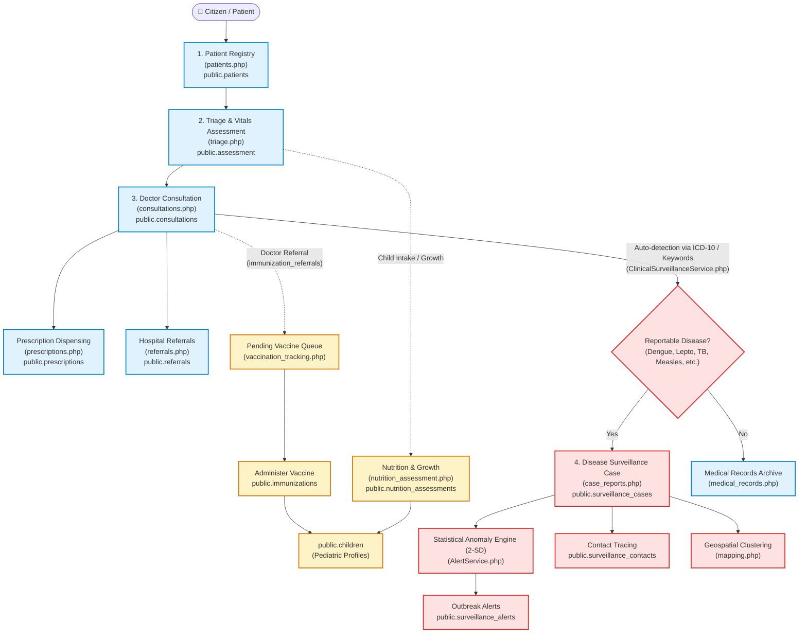
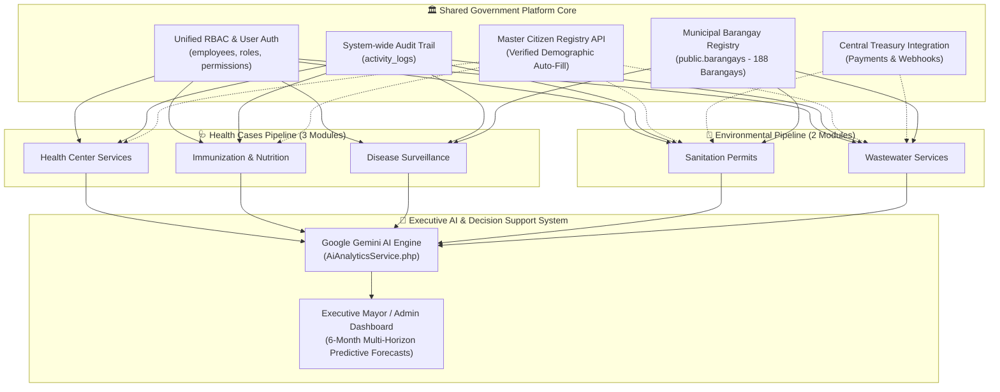

# 🔄 System Data Flow & Architecture Documentation
**Project:** Web-Based Health and Sanitation Management Information System with Gemini-Powered AI Analytics  
**Jurisdiction / Context:** Caloocan City Government (LGU Primary Care & Municipal Services)  
**Document Classification:** Architectural & Data Flow Specification  

---

## 📌 Executive Summary

The **Civentral Health & Sanitation Management Information System** operates on a modular, decoupled architecture reflecting the real-world operational structure of a Philippine Local Government Unit (LGU).

The system divides its core operations into two distinct pipelines:
1. **The Clinical Health Pipeline (3 Connected Modules):**
   - 🩺 **Health Center Services** (`modules/healthservices/`)
   - 💉 **Immunization & Nutrition** (`modules/immunization/`)
   - 🦠 **Epidemiological Disease Surveillance** (`modules/surveillence/`)
2. **The Environmental & Municipal Utility Pipeline (2 Independent / Decoupled Modules):**
   - 📋 **Sanitation Permits & Inspections** (`modules/sanitation/`)
   - 🚰 **Wastewater & Septic Management** (`modules/services/`)

> [!NOTE]  
> **Your intuition is 100% correct:** The 3 clinical modules are interconnected because they operate on the **same human biological subject (the citizen patient)** and participate in a shared continuum of clinical care and epidemiological reporting. In contrast, Sanitation Permits and Wastewater Services are decoupled because they govern **commercial regulatory compliance and physical municipal infrastructure**, each with distinct lifecycles, database schemas, legal mandates, and billing mechanisms.

---

## 🏛️ High-Level Architectural Comparison

| Dimension | 🩺 Clinical Health Pipeline (3 Modules) | 🌿 Environmental & Municipal Pipeline (2 Modules) |
| :--- | :--- | :--- |
| **Primary Data Entity** | **Human Patient / Citizen** (`public.patients`, `public.children`) | **Business Establishment** (`permits`) & **Physical Septic Tank** (`septic_tanks`) |
| **Modules Involved** | 1. Health Center Services<br>2. Immunization & Nutrition<br>3. Disease Surveillance | 1. Sanitation Permits & Inspections<br>2. Wastewater & Septic Management |
| **Governing Law / Mandate** | DOH Clinical Guidelines, RA 10173 (Data Privacy Act of 2012) | PD 856 (Sanitation Code), RA 9275 (Clean Water Act), LGU Revenue Code |
| **Transaction Nature** | Clinical intake, vital assessment, diagnosis, prescription, vaccination, epidemiology tracing | Application filing, sanitary inspection, septic siphoning/desludging, municipal fee billing |
| **Integration Type** | **Direct Database & Service Bridges** (`immunization_referrals`, `ClinicalSurveillanceService`, `AlertService`) | **Autonomous Pipelines** with shared platform infrastructure (RBAC, Audit Logs, AI Analytics, Central Treasury) |

---

## 🩺 Part 1: The 3 Interconnected Clinical Modules

The three health modules form a continuous clinical pipeline where actions in one module directly propagate data into the others.



### 1. How Health Center Services (`healthservices`) Connects to Immunization (`immunization`)

In earlier versions of healthcare software, child immunization and general patient clinics were isolated. In this codebase, they are linked via **three concrete architectural integration points**:

1. **Shared Patient Foreign Key (`patient_id`):**
   * Configured in migration [`database/migrations/2026_10_10_integrate_healthservices_immunization.sql`](file:///opt/lampp/htdocs/capstone/database/migrations/2026_10_10_integrate_healthservices_immunization.sql):
     ```sql
     ALTER TABLE public.immunizations 
       ADD COLUMN IF NOT EXISTS patient_id INTEGER NULL REFERENCES public.patients(id) ON DELETE CASCADE,
       ADD COLUMN IF NOT EXISTS patient_type VARCHAR(20) NOT NULL DEFAULT 'child';
     ```
   * This allows the immunization engine to vaccinate **both children** (referenced via `child_id`) and **adults/seniors** (Pneumococcal, Flu, Tetanus toxoid referenced via `patient_id`).

2. **The Clinical Referral Bridge (`immunization_referrals`):**
   * When an attending doctor finishes an examination in [`modules/healthservices/consultations.php`](file:///opt/lampp/htdocs/capstone/modules/healthservices/consultations.php), they can issue an immunization referral directly to the vaccination staff.
   * Stored in `public.immunization_referrals` (linking `patient_id`, `consultation_id`, `vaccine_requested`, and `urgency`).
   * In [`modules/immunization/vaccination_tracking.php`](file:///opt/lampp/htdocs/capstone/modules/immunization/vaccination_tracking.php#L69), the page automatically queries pending referrals:
     ```php
     $doctorReferrals = $db->select('immunization_referrals', ['status' => 'pending'], ['order' => 'created_at.desc', 'limit' => 10]);
     ```
   * Vaccinators can click **"Administer"** directly from the doctor's referral without re-entering patient data.

3. **Triage Routing:**
   * During intake in [`modules/healthservices/triage.php`](file:///opt/lampp/htdocs/capstone/modules/healthservices/triage.php), nurses can classify the consultation visit under `Maternal & Child Health` or `Immunization & Nutrition`, routing the patient directly to the immunization station.

---

### 2. How Health Center Services (`healthservices`) Connects to Disease Surveillance (`surveillence`)

The most critical health data flow is the **automated syndromic surveillance bridge**. Epidemiologists do not need to manually poll clinics for disease occurrences; the system bridges them programmatically.

1. **Automatic Clinical Evaluation on Consultation Save:**
   * Located in [`app/Controllers/ConsultationController.php`](file:///opt/lampp/htdocs/capstone/app/Controllers/ConsultationController.php#L213-L220):
     ```php
     // Primary Source Health Surveillance Bridge (Auto-detect & sync to surveillance_cases)
     try {
         require_once __DIR__ . '/../services/ClinicalSurveillanceService.php';
         $survService = new ClinicalSurveillanceService();
         $survService->syncConsultation($dbData);
     } catch (Throwable $e) {
         error_log('Consultation Health Surveillance Bridge error: ' . $e->getMessage());
     }
     ```

2. **ICD-10 & Keyword Matching Engine:**
   * Inside [`app/services/ClinicalSurveillanceService.php`](file:///opt/lampp/htdocs/capstone/app/services/ClinicalSurveillanceService.php), the service inspects:
     * **ICD-10 Code:** `A90` (Dengue), `A27` (Leptospirosis), `A15`/`A16` (Tuberculosis), `B05` (Measles), `A09` (Acute Gastroenteritis), `U07.1` (COVID-19), `J10` (Influenza).
     * **Syndromic Keywords:** Checks strings like *"breakbone"*, *"rat urine"*, *"NS1 positive"*, *"koplik spots"*, *"watery diarrhea"*.
   * If a match occurs, the service automatically maps the record into `public.surveillance_cases`.

3. **14-Day Deduplication & Statistical Anomaly Alerts:**
   * To prevent skewing outbreak numbers, `ClinicalSurveillanceService.php` checks if the patient already has an active surveillance case for that disease within the past 14 days. If so, it updates the existing record rather than creating a duplicate.
   * Immediately after saving, it calls [`app/services/AlertService.php`](file:///opt/lampp/htdocs/capstone/app/services/AlertService.php):
     ```php
     AlertService::getInstance($this->db)->syncThresholdBreaches();
     ```
   * If weekly cases exceed the historical moving baseline ($\text{Mean} + 2\times\text{Standard Deviation}$), a **Red Outbreak Alert** is dispatched to the surveillance command center.

---

### 3. How Immunization (`immunization`) Connects to Disease Surveillance (`surveillence`)

* **Vaccine-Preventable Disease (VPD) Outbreak Triggers:**
  * When `surveillance_cases` detects clusters of Measles (`B05`), Pertussis, or Polio in a specific barangay, the surveillance mapping engine flags low-vaccine coverage zones.
  * Public health nurses review [`modules/immunization/child_records.php`](file:///opt/lampp/htdocs/capstone/modules/immunization/child_records.php) filtered by barangay to schedule **Supplemental Immunization Activities (SIA)** and identify unvaccinated cohorts.

---

## 🌿 Part 2: The 2 Decoupled Environmental & Municipal Modules

The environmental modules handle physical municipal infrastructure and commercial sanitation regulations. They are intentionally decoupled from clinical health records.

```mermaid
flowchart TD
    subgraph SanitationPermits ["📋 1. Sanitation Permits & Clearances (sanitation/)"]
        AppStart([🏢 Business Owner / Applicant]) --> AppForm["Submit Application\n(permit_applications.php)\npublic.permits"]
        AppForm --> StaffReview{"Staff Review\nStatus: Pending"}
        StaffReview -->|Approved for Inspection| SchedInsp["Schedule Field Inspection\n(inspections.php)\npublic.inspections"]
        SchedInsp --> ConductInsp{"Sanitary Inspector Evaluates\nFood safety, water, waste"}
        ConductInsp -->|Failed / Violations| Remediation["Corrective Action Notice\nReschedule Inspection"]
        Remediation --> ConductInsp
        ConductInsp -->|Passed Compliant| PayStep["Payment Processing\n(payments.php)\npublic.payments"]
        PayStep --> IssuePermit["Issue Sanitary Clearance Certificate\n(permit_certificate.php)\nQR Code Verification"]
        IssuePermit --> PermitDocs["public.permit_documents\npublic.renewals"]
    end

    subgraph WastewaterServices ["🚰 2. Wastewater & Septic Management (services/)"]
        TankReg([🏠 Property Owner]) --> RegTank["Register Septic Tank\n(septic_tanks.php)\npublic.septic_tanks"]
        RegTank --> SvcReq["Request Siphoning / Desludging\n(services_management.php)\npublic.service_requests"]
        SvcReq --> Dispatch{"Assign Vacuum Tanker / Crew\n(providers.php)\npublic.service_providers"}
        Dispatch --> FieldMaint["Field Crew Logs Desludging Visit\n(maintenance.php)\nVolume m³, Parts, Findings"]
        FieldMaint --> CompleteSvc["Service Completed"]
        CompleteSvc --> WWBill["Compute Municipal Fee + 6% Tax\n(wastewater_billing.php)\npublic.wastewater_invoices"]
        WWBill --> WWPay["Payment Tendered\n(Cash / GCash / OTC)\nOfficial Receipt Issued"]
    end

    classDef sani fill:#ecfdf5,stroke:#059669,stroke-width:2px;
    classDef waste fill:#eff6ff,stroke:#2563eb,stroke-width:2px;
    class AppStart,AppForm,StaffReview,SchedInsp,ConductInsp,Remediation,PayStep,IssuePermit,PermitDocs sani;
    class TankReg,RegTank,SvcReq,Dispatch,FieldMaint,CompleteSvc,WWBill,WWPay waste;
```



### Module 4: Sanitation Permits & Clearances (`modules/sanitation/`)
* **Core Tables:** `public.permits`, `public.inspections`, `public.payments`, `public.renewals`, `public.permit_documents`.
* **Workflow:**
  1. **Application Intake:** Business owners apply for sanitary clearances (Food establishments, bars, salons, commercial buildings).
  2. **Field Inspection:** Sanitary inspectors evaluate food handling, potable water supply, vermin abatement, and restrooms.
  3. **Payment Collection:** Invoices paid through municipal cashier or digital wallets.
  4. **Certificate Generation:** Digital clearance certificates generated with verifiable cryptographic QR codes.
  5. **Annual Renewals:** Expiring clearances trigger reminders and automatic penalty calculations during grace periods.

### Module 5: Wastewater & Septic Management (`modules/services/`)
* **Core Tables:** `public.septic_tanks`, `public.service_requests`, `public.service_providers`, `public.maintenance_records`, `public.wastewater_invoices`.
* **Workflow:**
  1. **Tank Geolocation & Profiling:** Septic tanks registered by owner, capacity ($m^3$), construction type (concrete/plastic), and GPS coordinates.
  2. **Desludging Dispatch:** Siphoning requests prioritized (Emergency, High, Routine) and assigned to municipal vacuum tankers or accredited third-party contractors (`service_providers`).
  3. **Field Maintenance Log:** Field technicians record actual volume siphoned, sludge condition, and structural integrity.
  4. **Wastewater Billing:** Automatically calculates service fees plus mandatory 6% municipal tax, generating formal invoices and receipts.

---

## ❓ Why Are Environmental Modules Decoupled from Health Modules?

In software architecture, unnecessary coupling creates system fragility, data integrity violations, and security risks. Here is why the separation exists:

### 1. Distinct Entity Modeling (Biological vs. Regulatory vs. Physical)
* **Health Modules** model a **living biological patient**: Age, gender, blood pressure, heart rate, symptoms, diagnoses, allergies, and drug prescriptions.
* **Sanitation Permits** model a **legal business entity**: DTI/SEC registration, business name, line of industry, food handling permits, and inspection scores.
* **Wastewater Services** model **physical municipal infrastructure**: Concrete capacity, sludge volume in cubic meters, tanker truck fleet, vacuum hoses, and disposal tariffs.
* *Attempting to merge these into unified tables would violate Third Normal Form (3NF) database principles.*

### 2. Separation of Legal & Regulatory Frameworks
* **Clinical Health:** Bound by **medical confidentiality** and the **Data Privacy Act of 2012 (RA 10173)**. Patient consultations and diagnoses are strictly privileged medical records restricted to licensed doctors and nurses.
* **Sanitation Permits:** Governed by the **Code on Sanitation of the Philippines (PD 856)** and the **Business Permits & Licensing Office (BPLO)**. Sanitary clearance status is a public regulatory record.
* **Wastewater Management:** Governed by the **Philippine Clean Water Act of 2004 (RA 9275)** and municipal septage ordinances.

### 3. Financial & Revenue Isolation
* **Health Center Services:** Public health consultations, routine immunizations, and basic primary medicines are **free government services** provided by the LGU.
* **Sanitation & Wastewater:** Both are **revenue-generating municipal operations**. They issue formal invoices, calculate tax, enforce late renewal penalties, and reconcile with the Central Treasury.

---

## 🌐 Part 3: Where All 5 Modules Converge

While the two pipelines maintain distinct database tables and operational flows, they are unified under a **Centralized Enterprise Architecture**:



### 1. Shared Authentication & Role-Based Access Control (RBAC)
* All five modules share [`config/database.php`](file:///opt/lampp/htdocs/capstone/config/database.php), `public.employees`, `public.roles`, and `public.permissions`.
* Departmental firewalls prevent cross-access (e.g., a Sanitary Inspector cannot access confidential clinical consultations, and a Clinic Nurse cannot approve a desludging invoice).

### 2. Master Citizen Registry
* When a citizen registers as a patient (`patients.php`), applies for a sanitary permit (`permit_applications.php`), or requests septic tank siphoning (`services_management.php`), the system integrates with the **Master Citizen Registry** to auto-populate verified identity, DOB, contact numbers, and home addresses.

### 3. Geospatial (Barangay) Correlation
* All five modules record the citizen's or facility's **Barangay** (`public.barangays`).
* This enables cross-domain environmental health analysis:
  * *Example:* If **Disease Surveillance** detects an acute cluster of *Acute Gastroenteritis* or *Leptospirosis* in Barangay 77, municipal officers can cross-examine **Wastewater Maintenance Logs** (checking for septic leaks or un-siphoned overflow) and **Sanitation Inspections** (checking for food stalls operating without sanitary clearance in that exact zone).

### 4. Unified AI Analytics & Gemini Decision Support Engine
* Implemented in [`app/services/AiAnalyticsService.php`](file:///opt/lampp/htdocs/capstone/app/services/AiAnalyticsService.php) and [`pages/ai_insights.php`](file:///opt/lampp/htdocs/capstone/pages/ai_insights.php).
* Google Gemini synthesizes live data from **all 5 operational tables**:
  * Health Consultations (`consultations`)
  * Pediatric Vaccines (`immunizations`)
  * Outbreak Cases (`surveillance_cases`)
  * Commercial Clearances (`permits`)
  * Septic Operations (`service_requests`)
* It delivers unified executive recommendations to the Mayor and City Health Officer (e.g., predicting 6-month budget needs, staffing allocations, and seasonal disease surges).

---

## 🎯 Quick Defense Cheat-Sheet (Summary for Panel Questions)

| Question | Recommended Answer |
| :--- | :--- |
| **"Why did you connect Health Services, Immunization, and Surveillance?"** | *"Because they all revolve around the citizen's longitudinal health record. A consultation can reveal a need for vaccination (handled via our `immunization_referrals` bridge), and diagnosed infectious diseases automatically sync into `surveillance_cases` via our `ClinicalSurveillanceService` to detect outbreaks in real time."* |
| **"Why are Wastewater and Sanitation Permits separated from Health Services?"** | *"Because of Separation of Concerns and legal compliance. Sanitation permits govern commercial business establishments under the Sanitation Code (PD 856), and Wastewater governs physical infrastructure under the Clean Water Act (RA 9275). They involve commercial fees and municipal billing, whereas clinical health records are protected by medical privacy (RA 10173). Normalizing them into separate pipelines ensures data integrity and high performance."* |
| **"Do the environmental modules ever communicate with the health modules?"** | *"Yes, at the macro-governance and analytics level. All modules share the Municipal Barangay Registry and Master Citizen Registry. Furthermore, our Gemini-powered AI Analytics aggregates data across both pipelines to correlate environmental factors (e.g. failing septic tanks or unsanitary food establishments) with epidemiological disease spikes in the same barangay."* |
