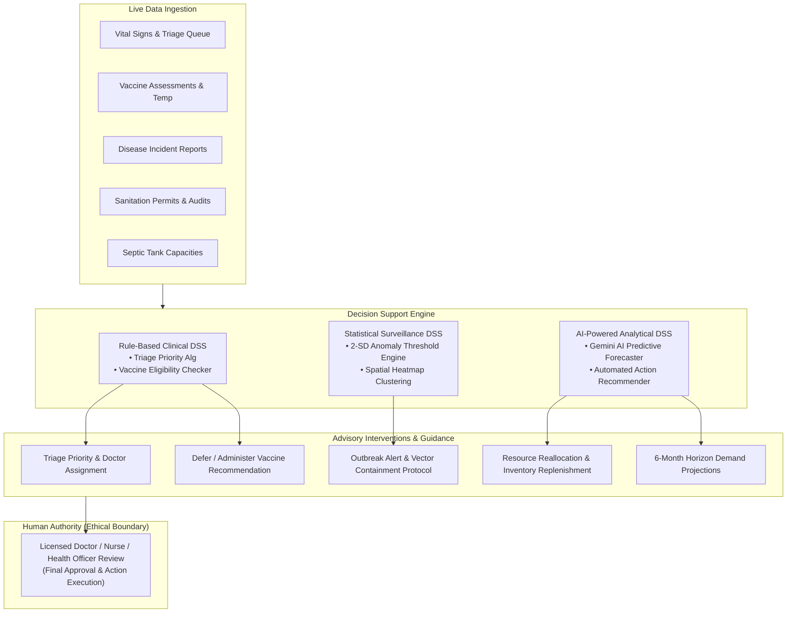

# Decision Support System (DSS) Architecture & Implementation Report
**System:** Web-Based Health and Sanitation Management Information System with Gemini-Powered AI Analytics  
**Jurisdiction:** Caloocan City Government  
**Document Generated:** October 2026  

---

## Executive Summary

The platform integrates **Decision Support Systems (DSS)** across two distinct operational paradigms:

1. **Rule-Based Clinical & Operational DSS:** Real-time algorithmic triage evaluation, contraindication verification, vector containment triggers, and regulatory compliance screening built directly into operational workflow modules.
2. **AI-Powered Predictive & Analytical DSS:** Powered by **Google Gemini API** (`gemini-2.5-flash` with automatic fallback to `gemini-3.6-flash`), paired with mathematical multi-horizon forecasting, automated narrative synthesis, and anomaly thresholding.

Both paradigms strictly enforce the core ethical mandate: **All AI and DSS outputs serve exclusively as advisory guidance; final clinical and administrative decisions remain with authorized government personnel.**

---

## 1. Clinical Decision Support System (CDSS)

### 1.1 Triage Urgency & Vital Signs Recommendation Engine
* **Location:** [`modules/healthservices/triage.php`](file:///opt/lampp/htdocs/capstone/modules/healthservices/triage.php#L1254-L1257) (lines 1254–1257, 2965–3002)
* **Mechanism:**
  - Dynamic algorithmic evaluation of patient physiological vitals during check-in:
    - **Systolic Blood Pressure (BP)**
    - **Body Temperature (°C)**
    - **Oxygen Saturation ($SpO_2$)**
    - **Heart Rate (BPM)**
  - **Decision Rules:**
    - Critical (Emergency): $SpO_2 < 90\%$ or Heart Rate $> 130$ or Temperature $\ge 39.5^\circ\text{C}$ or Systolic $\ge 180$.
    - High Urgency: $SpO_2 < 95\%$ or Heart Rate $> 110$ or Temperature $\ge 38.5^\circ\text{C}$ or Systolic $\ge 140$.
    - Medium: Temperature $\ge 37.5^\circ\text{C}$ or Systolic $\ge 130$.
    - Low: Normal physiological parameters.
  - **UI/UX Display:**
    - `Clinical DSS Recommendation: [Level] ([Reason])`
    - Displays active badge: `"Nurse Override Active"` to permit attending triage nurses to exercise independent clinical judgement over the machine recommendation.

---

### 1.2 Pediatric Immunization Eligibility & Contraindication Advisory
* **Location:** [`modules/immunization/vaccination_tracking.php`](file:///opt/lampp/htdocs/capstone/modules/immunization/vaccination_tracking.php#L800-L805) (lines 800–805, 1008–1030)
* **Mechanism:**
  - Evaluates recorded child temperature, current health status (e.g., Fever, Acute Illness), and documented contraindications prior to administering routine vaccines (BCG, Pentavalent, OPV/IPV, MMR).
  - **Decision Rules:**
    - If $\text{Temperature} \ge 38.0^\circ\text{C}$, status = `Fever`, or contraindications $\ne$ `None`:
      - **Advisory Trigger:** Automatically sets badge to `⚠️ Vaccination Deferred`.
      - **Actionable Guidance:** *"Caution: Patient presents elevated temperature ($T^\circ\text{C}$) or reported contraindications. Clinical recommendation: Defer vaccination and consult attending physician."*
    - Otherwise:
      - **Advisory Trigger:** `✓ Eligible for Vaccination`.
      - **Actionable Guidance:** *"Based on recorded assessment: Patient appears healthy with normal temperature and no reported contraindications. Recommended to proceed with scheduled vaccine administration."*
  - **Disclaimer:** *"Advisory decision support only. Final clinical decision rests with the healthcare professional."*

---

### 1.3 Specialist Consultation & Referral Urgency Classifier
* **Location:** [`modules/healthservices/referrals.php`](file:///opt/lampp/htdocs/capstone/modules/healthservices/referrals.php#L128-L148)
* **Mechanism:**
  - Automatic triaging of outgoing hospital and specialist referrals into `Critical`, `Emergency`, `Urgent`, or `Routine`.
  - Flags emergency cases with warning banners and alerts attending doctors to immediate ambulance transport requirements.

---

## 2. Epidemiological & Surveillance Decision Support

### 2.1 2-Standard Deviation (2-SD) Moving Baseline Outbreak Detector
* **Location:** [`app/services/AlertService.php`](file:///opt/lampp/htdocs/capstone/app/services/AlertService.php#L125-L165) & [`modules/surveillence/outbreak_command.php`](file:///opt/lampp/htdocs/capstone/modules/surveillence/outbreak_command.php)
* **Mechanism:**
  - Statistical anomaly detection evaluating live weekly cases against a 12-week rolling historical baseline across 9 reportable diseases (*Dengue, Leptospirosis, Measles, Tuberculosis, Influenza, Acute Gastroenteritis, COVID-19, Hypertension, Diabetes*).
  - **Mathematical Criteria:**
    $$\text{Threshold} = \mu_{\text{12-wk}} + 2 \times \sigma_{\text{12-wk}}$$
    (Minimum case floor: 3 cases).
  - **Decision Status Output:**
    - `🔴 Outbreak Alert (Critical)`: Live weekly cases breach the 2-SD statistical threshold.
    - `🟡 Watch (Elevated)`: Cases exceed historical mean $\mu$ by $> 1 \text{ SD}$.
    - `🟢 Normal`: Operating within baseline variance.

---

### 2.2 Geospatial Hotspot & Cluster Containment Actions
* **Location:** [`modules/surveillence/mapping.php`](file:///opt/lampp/htdocs/capstone/modules/surveillence/mapping.php#L225-L255)
* **Mechanism:**
  - Real-time spatio-temporal clustering of case coordinates using MapLibre GL and Leaflet Heat.
  - Automatically identifies **Top Hotspot Area (Barangay)** and **Top Disease**.
  - **Recommended Operational Intervention:** Triggers municipal vector control protocol (e.g., targeted larviciding, fogging schedules, and deploying sanitary inspectors to high-risk water-holding zones).

---

## 3. Executive AI Decision Support & Actionable Recommendations

### 3.1 Live Department-Scoped AI Insights & Interventions
* **Location:** [`app/services/AiAnalyticsService.php`](file:///opt/lampp/htdocs/capstone/app/services/AiAnalyticsService.php#L270-L476) & [`pages/ai_insights.php`](file:///opt/lampp/htdocs/capstone/pages/ai_insights.php#L913-L984)
* **Mechanism:**
  - Generates situational analysis, severity impact scoring (`Critical`, `Moderate`, `Notice`), confidence ratings ($88\% - 96\%$), and concrete operational action recommendations:

| Scope | Category | Detected Condition | Decision Support / Recommended Action |
|---|---|---|---|
| **Disease Surveillance** | Outbreak Early Warning | Active case clusters detected in specific Barangay | *Deploy Rapid Response Vector Control unit to the hotspot Barangay immediately.* |
| **Disease Surveillance** | Contact Tracing Status | Active close contacts under monitoring | *Complete 14-day symptom verification for remaining monitored contacts.* |
| **Health Center** | Outpatient Volume | High patient queue in satellite center | *Reassign 2 additional health inspectors/nurses to satellite triage.* |
| **Health Center** | Pharmacy Logistics | Prescriptions dispensed vs remaining inventory | *Ensure essential antibiotics and analgesics replenishment for upcoming clinic week.* |
| **Sanitation Permits** | Backlog Mitigation | Pending permit applications approaching deadline | *Expedite commercial sanitary reviews prior to the 15th of the month.* |
| **Sanitation Permits** | Food & Business Audits | Violations logged during audits | *Schedule follow-up inspections for food service establishments in market zone.* |
| **Immunization** | Vaccine Demand | Newborn cohort due for routine Expanded Program on Immunization (EPI) | *Confirm Pentavalent and Measles vaccine supply with Provincial Cold Chain.* |
| **Immunization** | Child Nutrition | Operation Timbang weight-for-age screening | *Enroll borderline underweight children in 90-day supplementary feeding program.* |
| **Wastewater Services** | Desludging Queue | High volume of residential pumping requests | *Dispatch vacuum tanker fleet unit to designated residential barangay clusters.* |
| **Wastewater Services** | Environmental Quality | Commercial effluent discharge audits | *Conduct effluent grab sampling at commercial carwash and restaurant grease traps.* |

---

### 3.2 6-Month Multi-Horizon Predictive Forecasts
* **Location:** [`app/services/AiAnalyticsService.php`](file:///opt/lampp/htdocs/capstone/app/services/AiAnalyticsService.php#L500-L680)
* **AI Integration:** Google Gemini (`GeminiAiService::generateAiForecast()`) with mathematical linear regression fallback ($R^2$ fit calculation).
* **Decision Support Function:**
  - Projects **6-Month forward demand** for:
    - Outpatient consultations and triage queue loads.
    - Commercial sanitary permit applications and health card renewals.
    - Pediatric vaccine doses required to maintain zero-defaulter thresholds.
    - Septic tank desludging requests and wastewater treatment volume.
  - Generates forward-looking AI narratives alerting administrators to expected seasonal surges (e.g., monsoon gastro/dengue increases or start-of-year business permit surges).

---

## 4. Sanitation & Wastewater Operational DSS

### 4.1 Field Inspection Remediation & Violation Corrective Actions
* **Location:** [`modules/sanitation/inspections.php`](file:///opt/lampp/htdocs/capstone/modules/sanitation/inspections.php#L600-L605)
* **Mechanism:**
  - Evaluates food safety, water source, and sanitary checklist items.
  - Automatically flags conditional passes or failures, mandating specific remediation requirements and calculating reinspection windows (e.g., 7-day or 14-day grace periods).

### 4.2 Desludging Maintenance & Preventive Siphoning Interval
* **Location:** [`modules/services/maintenance.php`](file:///opt/lampp/htdocs/capstone/modules/services/maintenance.php#L645-L650)
* **Mechanism:**
  - Tracks septic tank sludge capacity, historical cleaning dates, and tank dimensions.
  - Generates recommended desludging intervals (e.g., 3-to-5-year municipal desludging cycle) and environmental safety recommendations to prevent groundwater contamination.

---

## 5. Summary of Decision Support Architecture

---

## Key Verification References in Codebase

1. **Clinical Triage DSS:** [`modules/healthservices/triage.php:1254`](file:///opt/lampp/htdocs/capstone/modules/healthservices/triage.php#L1254)
2. **Vaccine Contraindication Advisory:** [`modules/immunization/vaccination_tracking.php:1008`](file:///opt/lampp/htdocs/capstone/modules/immunization/vaccination_tracking.php#L1008)
3. **Outbreak Anomaly Thresholding:** [`app/services/AlertService.php:130`](file:///opt/lampp/htdocs/capstone/app/services/AlertService.php#L130)
4. **Actionable AI Recommendations:** [`app/services/AiAnalyticsService.php:275`](file:///opt/lampp/htdocs/capstone/app/services/AiAnalyticsService.php#L275)
5. **Multi-Horizon Predictive Forecaster:** [`app/services/AiAnalyticsService.php:500`](file:///opt/lampp/htdocs/capstone/app/services/AiAnalyticsService.php#L500)
6. **Executive Insights Interface:** [`pages/ai_insights.php:913`](file:///opt/lampp/htdocs/capstone/pages/ai_insights.php#L913)
