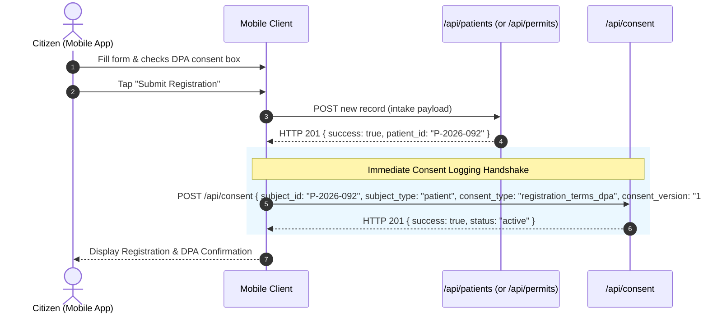

# Mobile App Consent Integration Specification (DPA Compliance)

> **Document Type:** Mobile Client Architectural Specification  
> **Target System:** Civentral Citizen & Patient Mobile Application  
> **Governing Law:** Republic Act No. 10173 (Data Privacy Act of 2012) & NPC Circulars  
> **Status:** Draft / Specification Phase (Implementation scheduled)  

---

## 1. Overview

Under the Philippine Data Privacy Act of 2012 (RA 10173), processing of personal and sensitive personal information (PHI/PII) requires freely given, specific, and informed consent.

This document details the required UI components, behavior, and API contract for integrating consent capture on mobile citizen intake and registration screens.

---

## 2. Target UI Components & Flow

### 2.1 Citizen Registration / Intake Screen
The registration form must include a dedicated **Data Privacy & Consent Section** immediately preceding the final Submit/Register button.

#### Visual Elements
1. **Interactive Checkbox:**
   - **ID / Key:** `dpaConsentCheckbox`
   - **Default State:** Unchecked (`false`). Pre-ticked checkboxes are **strictly prohibited** under DPA.
2. **Consent Text & Link:**
   > ☑ *"I have read and agree to the [Civentral Privacy Notice & Terms of Processing](privacy_policy_modal) pursuant to Republic Act No. 10173 (Data Privacy Act of 2012)."*
3. **Modal / Bottom Sheet:**
   - Tapping the link must open a scrollable Bottom Sheet displaying:
     - Categories of data collected (name, address, contact, clinical/health history).
     - Purpose of collection (LGU health clinic triage, sanitary permit processing, municipal epidemiology).
     - Retention period and citizen's Right to Erasure / Rectification.
     - DPO (Data Protection Officer) contact details.

#### Submit Button Validation State
- The primary action button (`Register` / `Submit Application`) must remain **disabled** (`opacity: 0.5`, non-clickable) until:
  1. All required profile fields are valid.
  2. `dpaConsentCheckbox` is checked.

---

## 3. API Integration Contract

### 3.1 Endpoint
- **URL:** `https://<civentral-api-host>/api/consent`
- **Method:** `POST`
- **Headers:**
  ```http
  Content-Type: application/json
  Authorization: Bearer <CITIZEN_API_TOKEN_OR_SESSION_TOKEN>
  X-Intake-Token: <TEMPORARY_INTAKE_SESSION_TOKEN>
  ```

### 3.2 Registration Submission Flow



### 3.3 Request Payload

```json
{
  "subject_id": "P-2026-092",
  "subject_type": "patient",
  "consent_type": "registration_terms_dpa",
  "consent_version": "1.0",
  "user_agent": "CiventralApp/1.2.0 (Android 14; Pixel 7)"
}
```

> **Note on Client IP:** The mobile client does not need to send `ip_address`. The Civentral backend automatically resolves and sanitizes the true network IP from connection headers (`X-Forwarded-For` / `REMOTE_ADDR`) to prevent client-side IP spoofing.

### 3.4 Success Response (HTTP 201)

```json
{
  "success": true,
  "message": "Consent recorded successfully",
  "data": {
    "id": 14,
    "subject_id": "P-2026-092",
    "subject_type": "patient",
    "consent_type": "registration_terms_dpa",
    "consent_version": "1.0",
    "ip_address": "120.29.74.112",
    "user_agent": "CiventralApp/1.2.0 (Android 14; Pixel 7)",
    "status": "active",
    "consented_at": "2026-09-04 18:48:00+08"
  }
}
```

---

## 4. Consent Withdrawal Mechanism (Mobile Account Settings)

### 4.1 UI Location
Located in **Profile & Settings → Privacy & Security → Manage Data Consents**.

### 4.2 Withdrawal Action
- Lists all active consents with date agreed.
- Selecting **Withdraw Consent** opens an alert dialog warning:
  > *"Withdrawing consent for clinical data processing may prevent municipal health centers from providing digital queueing or online consultation records. Are you sure?"*
- Upon citizen confirmation:

### 4.3 Withdrawal API Call
- **URL:** `POST https://<civentral-api-host>/api/consent/withdraw`
- **Payload:**
  ```json
  {
    "subject_id": "P-2026-092",
    "subject_type": "patient",
    "consent_type": "registration_terms_dpa",
    "reason": "Citizen opt-out from digital service processing via mobile settings"
  }
  ```
- **Response (HTTP 200):**
  ```json
  {
    "success": true,
    "message": "Consent successfully withdrawn",
    "data": {
      "subject_id": "P-2026-092",
      "consent_type": "registration_terms_dpa",
      "status": "withdrawn",
      "withdrawn_at": "2026-09-04 18:50:00+08"
    }
  }
  ```

---

## 5. Security & Verification Checklist for Mobile Developers
1. **Never Hardcode Consent:** Never default the checkbox to `true`.
2. **Offline Mode:** If registering offline during remote health drives, the consent timestamp and client payload must be queued locally and synchronized immediately upon network reconnection.
3. **Session Verification:** Requests must carry the citizen session JWT or temporary intake token.
