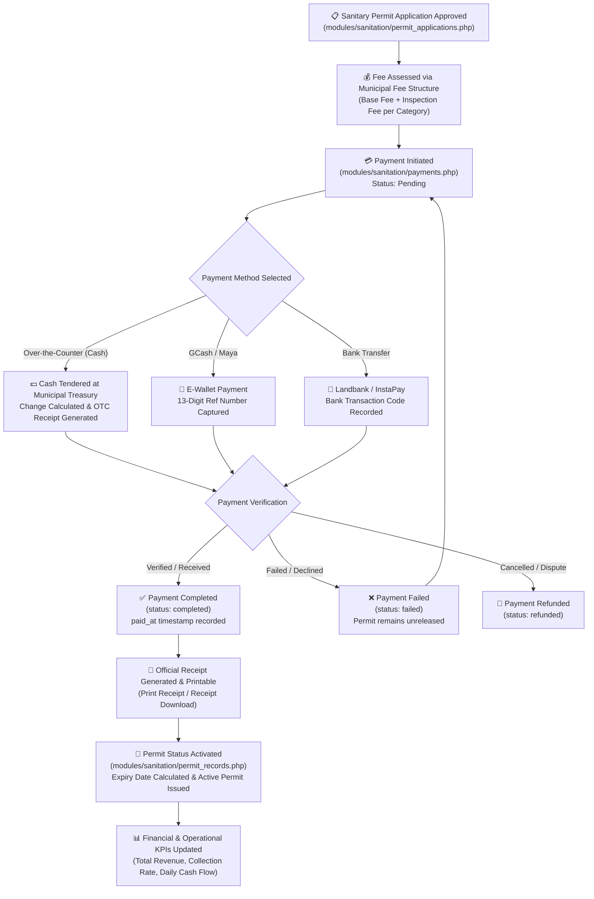

# 💳 Sanitation Permits — Payment Processing & Financial Workflow

---

## 🎯 Overview

The **Sanitation Permits Payment Workflow** governs the fee assessment, collection, verification, and receipt issuance for all municipal sanitation permits, sanitary inspections, and health certificates in the Civentral Health & Sanitation system.

It bridges the gap between regulatory compliance (inspections and permit reviews) and legal authorization (issuing active municipal permits).

---

## 🔄 End-to-End Lifecycle & State Transitions

---

## 🏛️ Municipal Fee Structure

Municipal sanitation fees are classified according to local revenue ordinances and establishment risk profiles:

| Establishment Category | Risk Tier | Base Fee | Inspection Fee | Total Municipal Fee |
|---|---|---|---|---|
| **Food & Dining (Class A)** | High | ₱1,500.00 | ₱500.00 | **₱2,000.00** |
| **Food & Dining (Class B)** | Medium | ₱1,000.00 | ₱350.00 | **₱1,350.00** |
| **Commercial & Retail** | Low-Medium | ₱800.00 | ₱300.00 | **₱1,100.00** |
| **Industrial / Manufacturing** | High | ₱2,500.00 | ₱1,000.00 | **₱3,500.00** |
| **Health & Wellness / Personal Care**| Medium | ₱750.00 | ₱250.00 | **₱1,000.00** |
| **School & Institutional Facilities** | Medium-High | ₱1,200.00 | ₱400.00 | **₱1,600.00** |

> [!NOTE]
> Rates are role-guarded. Only users with **Department Head** or **Administrator** roles can modify base municipal fee rates or add new assessment schedules (`$canManageFees`).

---

## 💻 User Interface & Operational Architecture (`modules/sanitation/payments.php`)

To ensure ergonomic daily operations for treasury staff and inspectors, the payments page follows the modern design system established in the system:

### 1. Modern KPI Cards
- **Total Payments**: Global volume of all processed and recorded payments.
- **Completed**: Successfully cleared payments.
- **Pending**: Unpaid permits awaiting cashier action or online verification.
- **Failed**: Rejected transactions requiring resolution.
- **Total Revenue**: Live municipal revenue collection formatted in Philippine Pesos (`₱`).

### 2. Collapsible Fee Structure Reference
- **Header**: Compact accordion bar (`#feeStructureBody`, `toggleFeeStructure()`), collapsed by default to maximize vertical workspace for cashier queues.
- **Responsive Card Grid**: Each fee tier presented as a crisp card showing base fee, inspection fee, and total amount.
- **Administrative Controls**: Role-guarded Quick Edit buttons for authorized heads and administrators.

### 3. Unified Action Toolbar
Consolidates all controls into a unified layout:
- **Search Input**: Live searching by Permit ID, Applicant Name, or Reference Number.
- **Status Filter**: `All Status`, `Completed`, `Pending`, `Failed`, `Refunded`.
- **Payment Method Filter**: `All Methods`, `Cash / OTC`, `GCash`, `PayMaya`, `Bank Transfer`.
- **Custom Date Range Filter Modal (`#dateFilterModal`)**: Quick presets (*Today*, *Last 7 Days*, *This Month*, *Last 30 Days*, *This Year*, *All Time*) plus custom date pickers without clumsy browser date controls.
- **Reset Button**: One-click filter clear button.
- **Action Buttons**: Primary `Process Payment` modal trigger and `Export CSV` tool.

### 4. High-Clarity Transaction Table
- **Payment ID**: Formatted as monospace badge (`font-mono text-xs font-bold text-brand-dark`).
- **Applicant & Permit Details**: Combined primary applicant name and permit code.
- **Currency Display**: Standardized `₱` format with thousands separators.
- **Color-Coded Status & Method Badges**: Visual indicators with iconography for rapid audit review.
- **Actions Menu**: View receipt details, reprint official receipt, and execute manual completion for pending transactions.

---

## 🔐 Role-Based Access Control (RBAC)

| Role | View Records | Process Payment | Edit/Cancel Payment | Manage Municipal Fees | Export Data |
|---|:---:|:---:|:---:|:---:|:---:|
| **Department Head** | ✅ | ✅ | ✅ | ✅ | ✅ |
| **Administrator** | ✅ | ✅ | ✅ | ✅ | ✅ |
| **Cashier / Treasury Staff**| ✅ | ✅ | ❌ | ❌ | ✅ |
| **Sanitary Inspector** | ✅ | ❌ | ❌ | ❌ | ❌ |
| **General Staff** | ✅ (Read-Only) | ❌ | ❌ | ❌ | ❌ |

---

## 🗄️ Database Tables & Integration Points

1. **`payments`**: Core transaction ledger.
   - `id`, `payment_id`, `permit_id`, `amount`, `method`, `reference_number`, `status`, `notes`, `created_at`, `paid_at`.
2. **`permits`**: Sanitary permit master record.
   - `id`, `permit_id`, `applicant`, `business_name`, `status`, `payment_status`, `expiry_date`.
3. **`fee_structure` / `fee_structure.json`**: Official ordinance rate catalog.
