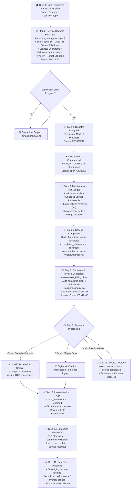

# 🚰 Wastewater Services — Operational Workflow & Architecture

---

## 🎯 Executive Summary

The **Wastewater Services Subsystem** provides an end-to-end municipal management framework for septic tank tracking, desludging requests, scheduled preventive maintenance, field technician dispatching, fee quotation, billing, and post-service customer feedback.

This system guarantees environmental compliance with national sanitation standards, prevents duplicate billing, ensures transparent revenue collection, and provides real-time field visibility.

---

## 📊 Module Suite Architecture

The subsystem is partitioned into **5 unified modules**:

| Module | File | Role & Primary Responsibilities |
|---|---|---|
| **Septic Tank Registry** | [`modules/services/septic_tanks.php`](file:///d:/xampp/htdocs/Civentral_HealthSanitation--Web/modules/services/septic_tanks.php) | Catalog tanks by owner, geolocation, barangay, capacity, and sludge history. |
| **Services Management** | [`modules/services/services_management.php`](file:///d:/xampp/htdocs/Civentral_HealthSanitation--Web/modules/services/services_management.php) | Consolidated intake for desludging, inspection, maintenance requests, and work order tracking. |
| **Maintenance Visits** | [`modules/services/maintenance.php`](file:///d:/xampp/htdocs/Civentral_HealthSanitation--Web/modules/services/maintenance.php) | Field technician execution logs, equipment usage, parts replacement, and inspection findings. |
| **Wastewater Billing** | [`modules/services/wastewater_billing.php`](file:///d:/xampp/htdocs/Civentral_HealthSanitation--Web/modules/services/wastewater_billing.php) | Quotations, municipal fee schedules (6% tax), invoice issuance, OTC receipt generation, and overdue alerts. |
| **Accredited Providers** | [`modules/services/providers.php`](file:///d:/xampp/htdocs/Civentral_HealthSanitation--Web/modules/services/providers.php) | Manage accredited private desludging contractors, fleet vehicles, and regulatory licenses. |

---

## 🔄 End-to-End Operational Lifecycle

---

## 🛠️ Step-by-Step Operational Details

### Phase 1: Registration & Property Onboarding
- Septic tanks are recorded with unique alphanumeric IDs (e.g., `ST-001`), owner identification, street address, and barangay.
- Capacity is tracked in cubic meters ($m^3$) or gallons, along with tank material (concrete, plastic, fiberglass) and last desludging timestamp.

### Phase 2: Request Intake & Duplicate Protection
- Requests are submitted via `services_management.php`.
- Selecting a `tank_id` automatically pre-populates client names, contact numbers, and site coordinates.
- **Duplicate Prevention**: The system restricts submitting a new request if the septic tank currently has an active `pending` or `in_progress` order, preventing accidental double booking.

### Phase 3: Field Crew Dispatch & Execution
- Technicians or third-party providers are allocated via `app/Models/Technician.php`.
- Status transitions sequentially: `pending` $\rightarrow$ `assigned` $\rightarrow$ `in_progress`.
- Field personnel record arrival, suction equipment parameters, and total volume extracted.

### Phase 4: Maintenance Logging & Quality Assurance
- Each intervention creates a verified record in `maintenance_records`.
- Documents structural cracks, baffle integrity, effluent clarity, and recommended follow-up schedules (typically 3–5 years for residential tanks).

### Phase 5: Billing, Tax Computation & Cashiering
- Once a service request reaches `completed` or `in_progress`, the operator can generate a municipal invoice in `wastewater_billing.php`.
- **Fee Configuration**: Municipal rates are loaded from `database/data/fee_structure.json` with write concurrency protection (`LOCK_EX`).
- **Taxation**: Base fees apply a standard 6% local government regulatory surcharge.
- **Cashiering Tools**:
  - Over-the-Counter cash change calculator.
  - Automatic `OTC-YYMMDD-XXXX` receipt code generator.
  - Multi-channel support (GCash, PayMaya, Landbank).

### Phase 6: Post-Service Rating & Feedback
- Completed requests prompt for a 1–5 star rating and client satisfaction comments.
- Average ratings are calculated with zero-division safeguards to keep executive dashboards accurate.

---

## 🔐 Role-Based Access Control Matrix

| System Action | Department Head | System Admin | Dispatcher / Staff | Field Technician | Private Provider |
|---|:---:|:---:|:---:|:---:|:---:|
| **Register Septic Tanks** | ✅ | ✅ | ✅ | ❌ | ❌ |
| **Submit Service Request** | ✅ | ✅ | ✅ | ❌ | ❌ |
| **Dispatch Technicians** | ✅ | ✅ | ✅ | ❌ | ❌ |
| **Update Work Status** | ✅ | ✅ | ✅ | ✅ | ✅ |
| **Log Maintenance Record**| ✅ | ✅ | ✅ | ✅ | ✅ |
| **Generate Quotation/Invoice**| ✅ | ✅ | ✅ | ❌ | ❌ |
| **Manage Municipal Fee Rates**| ✅ | ✅ | ❌ | ❌ | ❌ |
| **Process Payment / OTC** | ✅ | ✅ | ✅ | ❌ | ❌ |
| **View Analytics & Reports** | ✅ | ✅ | ✅ | ❌ (Own only) | ❌ (Own only) |

---

## 🗄️ Database Schema & Data Models

1. **`septic_tanks`** ([`app/Models/SepticTank.php`](file:///d:/xampp/htdocs/Civentral_HealthSanitation--Web/app/Models/SepticTank.php))
   - `id`, `tank_id`, `owner_name`, `address`, `barangay`, `capacity`, `tank_type`, `last_desludged`, `status`.
2. **`service_requests`** ([`app/Models/ServiceRequest.php`](file:///d:/xampp/htdocs/Civentral_HealthSanitation--Web/app/Models/ServiceRequest.php))
   - `id`, `request_id`, `tank_id`, `service_type`, `priority`, `preferred_date`, `status`, `assigned_to`, `rating`, `feedback`, `completed_at`.
3. **`maintenance_records`** ([`app/Models/MaintenanceRecord.php`](file:///d:/xampp/htdocs/Civentral_HealthSanitation--Web/app/Models/MaintenanceRecord.php))
   - `id`, `request_id`, `tank_id`, `technician_id`, `findings`, `volume_extracted`, `parts_replaced`, `inspection_date`.
4. **`technicians`** ([`app/Models/Technician.php`](file:///d:/xampp/htdocs/Civentral_HealthSanitation--Web/app/Models/Technician.php))
   - `id`, `name`, `phone`, `specialization`, `status` (`available`, `on_site`, `off_duty`), `provider_id`.
5. **`wastewater_invoices`** ([`app/Models/WastewaterInvoice.php`](file:///d:/xampp/htdocs/Civentral_HealthSanitation--Web/app/Models/WastewaterInvoice.php))
   - `id`, `invoice_id`, `client_name`, `tank_id`, `service_type`, `amount`, `tax`, `total_amount`, `due_date`, `status`, `payment_method`, `payment_reference`, `paid_at`.
